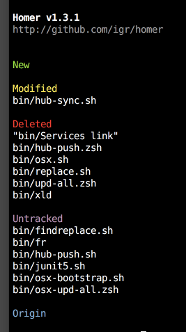

# Homer

Your `$HOME` needs **Homer** :)

**Homer** manages your dotfiles and folders using just `git`. No symlink is involved!
What makes **Homer** different is:

+ works directly in the `$HOME`
+ keeps tracking of added files, ignoring everythig else
+ _fully_ tracks all added folders (!)
+ there is no staging area (like in `git`). **Homer** hides this from user.

In other words, you pick files and folders from your `$HOME` and add it to the **Homer**. Everything else is ignored, which is very convenient when used in `$HOME`. **Homer** treats added files and folders differently:

+ _files_ are simply tracked when they are added.
+ _folders_, however, are fully synchronized! There is no need to manually add file(s) from added folder. **Homer** will do all that. Of course, you can use `.gitignore` in the folders to simply ignore some files.

This makes everyday-life much easier!

## Installation :gift:

Download `homer` to your `$PATH` or current folder. Done!

## Usage

### Setup :clapper:

First you need to _initialize_ **Homer** and connect to GitHub by passing `user/repo_name`:

```shell
homer init github-user/homer-repo
```

If you have another machine, just _clone_ **Homer** from the GitHub:

```shell
homer clone github-user/homer-repo
```

### Every-day work :sunny:

Anytime you can check the _status_ of what is going on; what is new, changed deleted or untracked:

```shell
homer status
```



Start _adding_ files and folders. When folder is added, all its files are added as well!
Use `.gitgnore` to ignore files.

```shell
homer add .zsh
homer add bin
...
```

If you already have some folders included in **Homer**, you can simply add all untracked files bellonging to included folders with simple:

```shell
homer add
```

You only need to add _new_ files. This is different from `git`: **Homer** does not
have staging area, so you just need to add new files.

Finally, _put_ all your changes to the repo (this command will also add all untracked files from included folders):

```shell
homer put
```

On the another computer, _get_ the changes:

```shell
homer get
```

### Reset and Remove :warning:

To reset some file:

```shell
homer reset bin/text.txt
```

You can reset all changes with:

```shell
homer reset
```

To remove single file from the repo:

```shell
homer remove <FILE>
```

### Update :rocket:

**Homer** can check for and download the update, if it exists:

```shell
homer update
```

This will download a new version of `homer` in your $HOME folder.

## Use with ❤

Do it!
